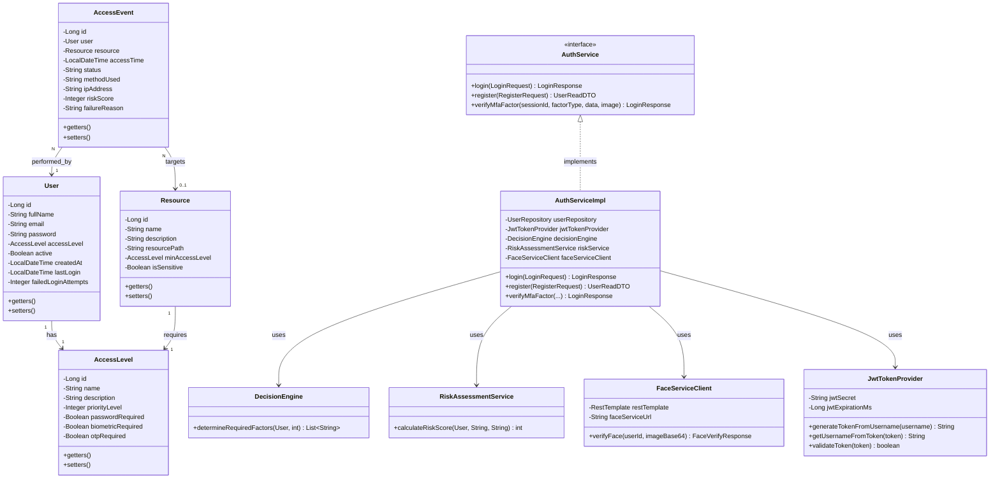
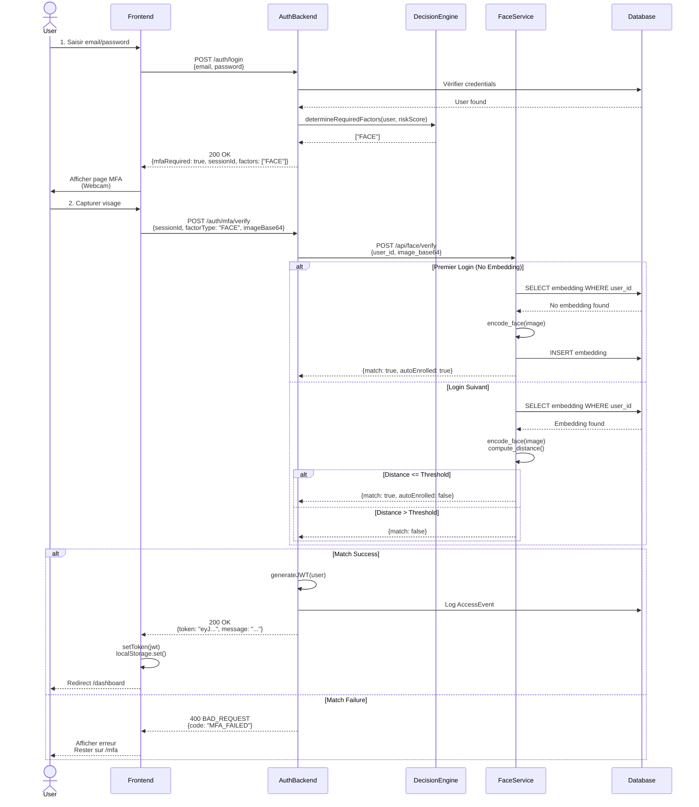

# 📊 RAPPORT DE SUIVI PROJET PFA
## Système de Reconnaissance Hybride Multi-Niveaux

**Date** : 9 Décembre 2024  
**Étudiante** : Chaimaa Amjad - Wissal Tajiri 
**Année** : 5IIR  


---

## 📋 Table des Matières

1. [Vue d'Ensemble du Projet](#vue-densemble)
2. [Architecture et Technologies](#architecture-et-technologies)
3. [État d'Avancement](#état-davancement)
4. [Fonctionnalités Implémentées](#fonctionnalités-implémentées)
5. [Problèmes Identifiés et Solutions](#problèmes-identifiés)
6. [Travail Restant](#travail-restant)
7. [Diagrammes Techniques](#diagrammes-techniques)
8. [Recommandations et Prochaines Étapes](#recommandations)

---

## 1. Vue d'Ensemble du Projet {#vue-densemble}

### Objectif

Développer un **système d'authentification adaptatif multi-facteurs** avec reconnaissance faciale pour contrôler l'accès à des ressources sensibles selon quatre niveaux de classification :

1. **PUBLIC** (Niveau 1)
2. **CONFIDENTIEL** (Niveau 2)
3. **SECRET** (Niveau 3)
4. **TOP SECRET** (Niveau 4)

### Contexte

Le système adapte dynamiquement les facteurs d'authentification requis en fonction du :
- **Niveau d'accès** de l'utilisateur
- **Sensibilité** de la ressource demandée
- **Score de risque** calculé en temps réel

### Résultats Clés à Ce Jour

✅ **Architecture microservices fonctionnelle** (3 services)  
✅ **Authentification MFA opérationnelle** (Password + Face)  
✅ **Auto-enrollment facial** implémenté et testé  
✅ **Interface utilisateur complète** et responsive  
⚠️ **Contrôle d'accès aux ressources** à finaliser (identifié hier)

---

## 2. Architecture et Technologies {#architecture-et-technologies}

### 2.1 Architecture Microservices

Le système est conçu selon une **architecture microservices** avec 3 services indépendants :

```mermaid
graph TB
    subgraph "Frontend Layer"
        A[React + Vite<br/>Port 3000]
    end
    
    subgraph "Backend Services"
        B[Auth Backend<br/>Spring Boot<br/>Port 8080]
        C[Face Service<br/>FastAPI Python<br/>Port 8001]
    end
    
    subgraph "Data Layer"
        D[(PostgreSQL<br/>Users, Resources,<br/>Events)]
        E[(SQLite<br/>Face Embeddings)]
    end
    
    A -->|HTTP/REST| B
    B -->|HTTP/REST| C
    B -->|JDBC| D
    C -->|SQLAlchemy| E
    
    style A fill:#61dafb,stroke:#333,stroke-width:2px,color:#000
    style B fill:#6db33f,stroke:#333,stroke-width:2px
    style C fill:#009688,stroke:#333,stroke-width:2px
    style D fill:#336791,stroke:#333,stroke-width:2px
    style E fill:#003b57,stroke:#333,stroke-width:2px
```



### 2.2 Stack Technologique Complet

#### Frontend
| Technologie | Version | Rôle |
|-------------|---------|------|
| **React** | 18.x | Framework UI |
| **TypeScript** | 5.x | Type safety |
| **Vite** | 5.x | Build tool & dev server |
| **React Router** | 6.x | Navigation SPA |
| **Axios** | 1.x | Client HTTP |
| **react-webcam** | 7.x | Capture faciale |
| **Tailwind CSS** | 3.x | Styling |

#### Backend (Auth-Backend)
| Technologie | Version | Rôle |
|-------------|---------|------|
| **Spring Boot** | 3.2.0 | Framework backend |
| **Java** | 17 | Langage |
| **Spring Security** | 6.x | Sécurité & JWT |
| **Hibernate/JPA** | 6.x | ORM |
| **PostgreSQL** | 15+ | Base de données |
| **Lombok** | 1.18.x | Réduction boilerplate |
| **Maven** | 3.9+ | Build tool |

#### Face-Service
| Technologie | Version | Rôle |
|-------------|---------|------|
| **FastAPI** | 0.104+ | Framework API |
| **Python** | 3.11+ | Langage |
| **OpenCV** | 4.x | Traitement d'image |
| **NumPy** | 1.x | Calculs numériques |
| **SQLAlchemy** | 2.x | ORM Python |
| **SQLite** | 3.x | DB embeddings |
| **Uvicorn** | 0.24+ | Serveur ASGI |
| **Pydantic** | 2.x | Validation données |

### 2.3 Justification Microservices

#### Avantages de cette Architecture

1. **Séparation des Responsabilités**
   - Auth-Backend : Gestion utilisateurs, sessions, contrôle d'accès
   - Face-Service : Reconnaissance faciale isolée (CPU/GPU intensif)

2. **Scalabilité Indépendante**
   - Face-Service peut être scalé séparément (charge variable)
   - Backend scalable selon nombre d'utilisateurs

3. **Technologies Adaptées**
   - Java/Spring : Robustesse, sécurité entreprise
   - Python/FastAPI : Performance ML, bibliothèques OpenCV

4. **Maintenance et Évolution**
   - Mise à jour d'un service sans impacter les autres
   - Ajout futur de nouveaux facteurs MFA (OTP service, etc.)

5. **Isolation des Pannes**
   - Si Face-Service down → fallback sur OTP possible
   - Résilience du système global

### 2.4 Communication Inter-Services

**Protocole** : REST over HTTP  
**Format** : JSON  
**Authentification** : JWT (Bearer token)

```
Frontend → Backend : JWT in Authorization header
Backend → Face-Service : Direct HTTP (interne)
```

---

## 3. État d'Avancement {#état-davancement}

### Récapitulatif Global

| Module | État | Pourcentage |
|--------|------|-------------|
| **Architecture & Infrastructure** | ✅ Terminé | 100% |
| **Base de Données** | ✅ Terminé | 100% |
| **Backend API (Auth)** | ✅ Terminé | 95% |
| **Face-Service (Biométrie)** | ✅ Terminé | 90% |
| **Frontend (UI/UX)** | ✅ Terminé | 95% |
| **Authentification MFA** | ✅ Fonctionnel | 95% |
| **Contrôle d'Accès Ressources** | ⚠️ En cours | 40% |
| **Tests & Validation** | ⚠️ En cours | 60% |
| **Documentation** | 🔄 En cours | 70% |

**Avancement Global** : **~85%**

---

## 4. Fonctionnalités Implémentées {#fonctionnalités-implémentées}

### 4.1 Authentification Multi-Facteurs (MFA)

#### ✅ Fonctionnalités Opérationnelles

**1. Login Initial (Facteur 1 : Mot de Passe)**
- ✅ Vérification mot de passe (hashage BCrypt)
- ✅ Détection tentatives échouées
- ✅ Génération sessionId MFA
- ✅ Calcul score de risque (IP, tentatives, etc.)

**2. Reconnaissance Faciale (Facteur 2 : Biométrie)**
- ✅ **Capture webcam en temps réel**
- ✅ **Auto-enrollment** (premier login = enregistrement automatique)
- ✅ **Vérification** (logins suivants = comparaison embedding)
- ✅ Encodage facial simplifié (moyenne pixels par région)
- ✅ Calcul de distance euclidienne
- ✅ Seuil configurable (actuellement 25.0)

**3. Génération JWT**
- ✅ Token HMAC-SHA256 signé
- ✅ Expiration configurable (24h par défaut)
- ✅ Claims : username, roles, dates

**4. Gestion Session**
- ✅ Contexte React (AuthContext) synchronisé
- ✅ LocalStorage pour persistence
- ✅ Refresh automatique au reload page
- ✅ Déconnexion (logout)

### 4.2 Interface Utilisateur

#### Pages Implémentées

1. **LoginPage** (`/login`)
   - Formulaire email/password
   - Validation frontend
   - Gestion erreurs

2. **MfaPage** (`/mfa`)
   - Capture webcam
   - Preview image capturée
   - Boutons Capturer/Valider/Annuler
   - Messages d'erreur contextuels

3. **Dashboard** (`/dashboard`)
   - Cartes de navigation par niveau
   - Statistiques utilisateur
   - Logout

4. **Pages Ressources** (x4)
   - PublicDocumentsPage (niveau 1)
   - ConfidentialDocumentsPage (niveau 2)
   - SecretDocumentsPage (niveau 3)
   - TopSecretDocumentsPage (niveau 4)

5. **Pages d'Erreur**
   - Page403 (Accès refusé)
   - Page404 (Non trouvé)

#### Composants Réutilisables

- `ProtectedRoute` : Guard de routes avec vérification niveau
- `ResourcePageLayout` : Layout commun pages ressources
- `ResourceCard` : Carte cliquable par niveau

### 4.3 Backend Services

#### Endpoints Implémentés

```
POST   /api/v1/auth/register          → Inscription utilisateur
POST   /api/v1/auth/login             → Authentification initiale
POST   /api/v1/auth/mfa/verify        → Vérification MFA

GET    /api/v1/resources              → Liste ressources
GET    /api/v1/resources/{id}         → Détails ressource
POST   /api/v1/resources              → Créer ressource
DELETE /api/v1/resources/{id}         → Supprimer ressource

GET    /api/v1/users                  → Liste utilisateurs
GET    /api/v1/users/{id}             → Détails utilisateur
PUT    /api/v1/users/{id}             → Modifier utilisateur

GET    /api/v1/access-levels          → Liste niveaux d'accès
POST   /api/v1/access-events          → Logger événement accès
```

#### Face-Service Endpoints

```
POST   /api/face/enroll               → Enregistrer visage
POST   /api/face/verify               → Vérifier visage (auto-enroll intégré)
GET    /health                        → Health check
GET    /docs                          → Documentation Swagger
```

### 4.4 Base de Données

#### Schéma Implémenté (PostgreSQL)

**Tables Principales** :
- `users` : Utilisateurs (email, password_hash, access_level_id, etc.)
- `access_levels` : Niveaux (PUBLIC, CONFIDENTIEL, SECRET, TOP_SECRET)
- `resources` : Ressources protégées (name, path, min_access_level_id)
- `access_events` : Logs d'accès (user, resource, timestamp, status)

**Relations** :
- User N→1 AccessLevel (ManyToOne)
- Resource N→1 AccessLevel (minAccessLevel)
- AccessEvent N→1 User
- AccessEvent N→1 Resource

#### Face Embeddings (SQLite)

**Table** : `face_embeddings`
- `id` : Primary key
- `user_id` : Email utilisateur
- `embedding` : Blob (NumPy array sérialisé)
- `created_at` : Timestamp enregistrement

---

## 5. Problèmes Identifiés et Solutions {#problèmes-identifiés}

### 5.1 Problème Critique Résolu (08/12/2024)

#### ❌ Problème : Redirection Immédiate vers Login après MFA

**Symptôme** :
- Utilisateur validait MFA Face
- Backend générait JWT correctement
- Frontend recevait le token
- **Mais redirection immédiate vers `/login`** au lieu de `/dashboard`

**Cause Racine** :
```typescript
// MfaPage.tsx (BUGGY)
if (response.token) {
    localStorage.setItem('token', response.token);  // ✅ LocalStorage OK
    // ❌ MAIS AuthContext.token reste null !
    navigate('/dashboard');
}

// ProtectedRoute.tsx
const { isAuthenticated } = useAuth();  // isAuthenticated = !!token (state)
if (!isAuthenticated) {
    return <Navigate to="/login" />;  // ← Redirection car state = null
}
```

**Solution Implémentée** :
```typescript
// 1. Exposer setToken dans AuthContext
export interface AuthContextType {
    // ...
    setToken: (token: string | null) => void;  // ✅ Ajouté
}

// 2. Appeler setToken IMMÉDIATEMENT dans MfaPage
if (response.token) {
    setToken(response.token);  // ✅ Mettre à jour l'état React
    localStorage.setItem('token', response.token);
    navigate('/dashboard');  // ✅ Navigation OK maintenant
}
```

**Résultat** : ✅ MFA fonctionne parfaitement !

### 5.2 Problème de Sécurité Identifié (08/12/2024)

#### ⚠️ Problème : Contrôle d'Accès Insuffisant aux Ressources

**Symptôme** :
- Utilisateur PUBLIC (niveau 1) peut naviguer vers `/documents/confidentiel`
- Page s'affiche avec données mock
- **Aucune vérification du niveau d'accès**

**Cause** :
1. ❌ Routes non protégées par `ProtectedRoute`
2. ❌ Données MOCK dans le frontend (pas d'API backend)
3. ❌ `ResourcePageLayout` n'implémente pas de vérification

**Solutions Proposées** :

**Solution 1 (URGENT)** : Protéger les routes
```typescript
// AppRouter.tsx
<Route path="/documents/confidentiel" element={
    <ProtectedRoute requiredPriority={2}>
        <ConfidentialDocumentsPage />
    </ProtectedRoute>
} />
```

**Solution 2** : Vérification dans ResourcePageLayout
```typescript
useEffect(() => {
    const userLevel = user?.accessLevel?.priorityLevel || 1;
    if (userLevel < levelPriority) {
        navigate('/403');
    }
}, [user, levelPriority]);
```

**Solution 3** : Backend API avec vérification
```java
@GetMapping("/confidential-documents")
public ResponseEntity<List<Document>> getConfidentialDocuments(
        @AuthenticationPrincipal UserDetails userDetails) {
    User user = userRepository.findByEmail(userDetails.getUsername()).orElseThrow();
    if (user.getAccessLevel().getPriorityLevel() < 2) {
        throw new AccessDeniedException("Niveau insuffisant");
    }
    return ResponseEntity.ok(documentService.getConfidentialDocuments());
}
```

**État** : ⚠️ Identifié, solutions préparées, **implémentation en attente de validation**

### 5.3 Limitations Techniques Connues

#### 1. Algorithme de Reconnaissance Faciale Simplifié

**Actuel** :
- Encodage : Moyenne pixels par région (8x8 grid = 64 valeurs)
- Distance : Euclidienne simple
- Seuil : Configurable (25.0)

**Limites** :
- ⚠️ Faible précision (conditions variables : lumière, angle, distance)
- ⚠️ Pas de deep learning
- ⚠️ Vulnérable aux photos/vidéos (pas de liveness detection)

**Recommandations Production** :
- Utiliser **face_recognition** (dlib) ou **DeepFace**
- Ajouter **liveness detection** (détection mouvement, clignement yeux)
- Utiliser embeddings 128D ou 512D au lieu de 64D

#### 2. Gestion OTP Non Implémentée

**État** : 
- ✅ Architecture prévue (DecisionEngine gère requiredFactors)
- ❌ Endpoint `/mfa/verify` avec `factorType="OTP"` → Non implémenté
- ❌ Pas d'intégration TOTP/SMS

**Impact** :
- Niveau CONFIDENTIEL requiert OTP (selon specs) → Actuellement non fonctionnel
- Fallback face-only pour démo

---

## 6. Travail Restant {#travail-restant}

### 6.1 Priorité 1 (Critique - Cette Semaine)

#### ✅ Sécuriser le Contrôle d'Accès

**Tâches** :
1. ✅ Ajouter `ProtectedRoute` sur toutes les routes ressources (2h)
2. ✅ Implémenter vérification dans `ResourcePageLayout` (1h)
3. ✅ Créer endpoints backend `/api/v1/documents/{level}` avec vérification (4h)
4. ✅ Connecter frontend aux vrais endpoints (2h)
5. ✅ Tester avec différents niveaux d'utilisateurs (2h)

**Estimation** : **1-2 jours**

### 6.2 Priorité 2 (Important - Avant Soutenance)

#### 📊 Tests et Validation

**Tests Unitaires** :
- Backend : Services (AuthService, ResourceService, RiskAssessment)
- Face-Service : encode_face, verify_face
- Frontend : Composants critiques (ProtectedRoute, AuthContext)

**Tests Intégration** :
- Flux complet login→MFA→dashboard
- Tentatives multi-utilisateurs
- Gestion erreurs réseau

**Tests Sécurité** :
- JWT expiration/invalidation
- SQL injection (prévention via JPA)
- XSS (prévention via React)
- Accès non autorisé aux ressources

**Estimation** : **3-4 jours**

#### 📝 Documentation

**Technique** :
- README complet (install, run, architecture)
- API documentation (Swagger/OpenAPI complète)
- Diagrammes à jour (architecture, séquence, classes)

**Utilisateur** :
- Guide utilisateur (login, MFA, navigation)
- Guide administrateur (gestion users, ressources)

**Académique** :
-Rapport PFA structuré (contexte, specs, implémentation, résultats)
- Supports présentation soutenance

**Estimation** : **2-3 jours**

### 6.3 Priorité 3 (Améliorations Optionnelles)

#### 🚀 Fonctionnalités Avancées

**1. Améliorer Face Recognition**
- Intégrer face_recognition (dlib) ou DeepFace
- Liveness detection
- Multi-faces detection

**2. Implémenter OTP**
- Backend : Génération TOTP (Google Authenticator)
- Frontend : Input code OTP
- Intégration dans DecisionEngine

**3. Dashboard Admin**
- Gestion utilisateurs (CRUD)
- Gestion ressources (CRUD)
- Visualisation logs d'accès
- Statistiques temps réel

**4. Audit et Logs**
- Logs structurés (JSON)
- Traçabilité complète (qui, quand, quoi, résultat)
- Alertes anomalies (tentatives répétées, etc.)

**Estimation** : **5-7 jours** (si temps disponible)

### 6.4 Planning Suggéré (10 Jours Restants)

```
Semaine 1 (Jours 1-3) : Sécurité
├─ J1 : Protéger routes + vérifications frontend
├─ J2 : Endpoints backend sécurisés
└─ J3 : Tests contrôle d'accès

Semaine 2 (Jours 4-7) : Tests & Doc
├─ J4-5 : Tests unitaires + intégration
├─ J6-7 : Documentation technique + utilisateur

Semaine 3 (Jours 8-10) : Finalisation
├─ J8 : Tests sécurité + corrections bugs
├─ J9 : Rapport PFA + slides soutenance
└─ J10 : Répétition soutenance + backup
```

---

## 7. Diagrammes Techniques {#diagrammes-techniques}

### 7.1 Diagramme de Classes (Backend)



### 7.2 Diagramme de Séquence - Login avec MFA



### 7.3 Architecture Détaillée des Couches

```mermaid
graph TD
    subgraph "Presentation Layer"
        A1[React Components]
        A2[React Router]
        A3[AuthContext]
        A4[API Clients]
    end
    
    subgraph "API Layer - Auth Backend"
        B1[AuthController]
        B2[ResourceController]
        B3[UserController]
        B4[Exception Handlers]
    end
    
    subgraph "Business Layer - Auth Backend"
        C1[AuthService]
        C2[ResourceService]
        C3[RiskAssessmentService]
        C4[DecisionEngine]
    end
    
    subgraph "Integration Layer"
        D1[FaceServiceClient]
        D2[JwtTokenProvider]
        D3[Security Filters]
    end
    
    subgraph "Face Service - Python"
        E1[Face Router]
        E2[Face Service Logic]
        E3[Encoding Functions]
    end
    
    subgraph "Data Layer"
        F1[(PostgreSQL)]
        F2[(SQLite Embeddings)]
    end
    
    A1 --> A4
    A4 --> B1
    A4 --> B2
    A4 --> B3
    
    B1 --> C1
    B2 --> C2
    B3 --> C1
    
    C1 --> C3
    C1 --> C4
    C1 --> D1
    C1 --> D2
    
    D3 -.->|Intercepts| B1
    D3 -.->|Intercepts| B2
    
    D1 --> E1
    E1 --> E2
    E2 --> E3
    
    C1 --> F1
    C2 --> F1
    E2 --> F2
    
    style A1 fill:#61dafb
    style B1 fill:#6db33f
    style C1 fill:#6db33f
    style E1 fill:#009688
    style F1 fill:#336791
    style F2 fill:#003b57
```



---

## 8. Recommandations et Prochaines Étapes {#recommandations}

### 8.1 Pour la Réunion de Suivi

#### Points Forts à Mettre en Avant

1. ✅ **Architecture Microservices Fonctionnelle**
   - 3 services indépendants communicants
   - Scalabilité et maintenabilité

2. ✅ **MFA Opérationnel**
   - Auto-enrollment innovant (UX fluide)
   - Reconnaissance faciale temps réel

3. ✅ **Stack Moderne**
   - Technologies actuelles (React, Spring Boot, FastAPI)
   - Best practices (JWT, REST, ORM)

4. ✅ **85% Avancement**
   - Fonctionnalités core implémentées
   - Tests en cours

#### Points à Discuter

1. ⚠️ **Contrôle d'Accès Ressources**
   - Problème identifié
   - Solutions préparées
   - **Demander validation approche** (3 niveaux de défense)

2. ⚠️ **Algorithme Face Recognition**
   - Actuel : Simplifié (démo)
   - **Discuter** : Améliorer avec face_recognition/DeepFace ?
   - Contraintes : Temps, complexité

3. 📅 **Planning Finalisation**
   - 10 jours restants estimés
   - **Valider priorités** avec encadrant
   - Arbitrage : Sécurité vs Features avancées

### 8.2 Décisions à Prendre

#### Question 1 : Contrôle d'Accès

**Options** :
- **A)** Implémenter les 3 niveaux (frontend + backend) ← **Recommandé**
- **B)** Frontend seulement (rapide mais moins sécurisé)
- **C)** Backend seulement (sécurisé mais UX moindre)

**Recommandation** : **Option A** (1-2 jours) pour sécurité réelle

#### Question 2 : Reconnaissance Faciale

**Options** :
- **A)** Garder algorithme simple (gain temps, démo fonctionnelle)
- **B)** Intégrer face_recognition (meilleure précision, +2-3 jours)
- **C)** Ajouter liveness detection (+1-2 jours)

**Recommandation** : **Option A pour démo**, mentionner B/C comme améliorations futures

#### Question 3 : OTP

**Options** :
- **A)** Implémenter OTP complet (+3-4 jours)
- **B)** Laisser pour version future
- **C)** Mock OTP (UI seulement, pas de vraie vérification)

**Recommandation** : **Option B** (hors scope si temps limité), **Option C** si démo nécessaire

### 8.3 Risques et Mitigation

| Risque | Probabilité | Impact | Mitigation |
|--------|-------------|--------|------------|
| Retard implémentation sécurité | Moyenne | Élevé | Prioriser, simplifier si besoin |
| Bugs dernière minute | Moyenne | Moyen | Tests continus, backup plan |
| Performance face recognition | Faible | Moyen | Optimiser seuil, ajouter cache |
| Complexité documentation | Faible | Faible | Templates, focus essentiel |

### 8.4 Critères de Succès pour Soutenance

#### Fonctionnalités Minimum Requises

- ✅ Login password fonctionnel
- ✅ MFA facial fonctionnel (auto-enrollment)
- ✅ Dashboard accessible après MFA
- ✅ Contrôle d'accès par niveau (routes protégées)
- ✅ 4 pages ressources (PUBLIC, CONFIDENTIEL, SECRET, TOP_SECRET)
- ✅ Page 403 si accès refusé
- ✅ Architecture microservices démontrée

#### Bonus (si temps)

- 🎁 Tests automatisés (unitaires + intégration)
- 🎁 Liveness detection faciale
- 🎁 Dashboard admin (gestion users)
- 🎁 OTP fonctionnel
- 🎁 Logs/audit complets

---

## 📌 Conclusion

Le projet **Système de Reconnaissance Hybride Multi-Niveaux** est à **~85% d'avancement**. L'architecture microservices est solide, l'authentification MFA fonctionne, l'interface est complète.

**Travail prioritaire** : Sécuriser le contrôle d'accès aux ressources (1-2 jours) puis finaliser tests et documentation (5-7 jours).

**Recommandation** : Se concentrer sur la sécurité et la stabilité plutôt que sur des features avancées optionnelles. Le système actuel est déjà une démo fonctionnelle et impressionnante de l'architecture microservices et du MFA adaptatif.

---

**Préparé par** : Chaimaa Amjad  
**Date** : 9 Décembre 2024  
**Pour** : Réunion de suivi projet PFA
